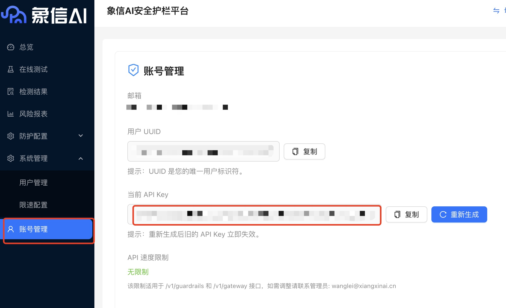

# Xiangxin AI Guardrails 象信AI安全护栏

**Author:** xiangxinai  
**Version:** 0.0.1  
**Type:** tool  

## Description  

### Overview | 概述  

The **Xiangxin AI Guardrails plugin** provides enterprise-grade AI safety tools for Dify applications.  
It is **open-source, free, context-aware, and designed for enterprise protection**.  

Xiangxin AI Guardrails focuses on:  
- **Both guardrails LLM and platform are open sourced** (Apache 2.0)  
- **Prompt Injection Attack Detection** (based on **OWASP TOP 10 LLM Applications**)  
- **Content Safety & Compliance** (based on **GB/T45654-2025 National Standard**)  
- **Contextual Semantic Understanding** for precise detection  
- **Enterprise-Grade Protection** with dual deployment modes:  
  - **API Detection Mode** – flexible integration and precise control  
  - **Security Gateway Mode** – WAF-like transparent proxy, zero code change  

象信AI安全护栏是 **开源、免费、具备上下文语义理解能力的企业级AI安全护栏**。  
主要功能包括：  
- **开源免费私有化部署**（护栏检测大模型和企业级护栏平台均基于 Apache 2.0 协议开源，支持私有化部署）  
- **提示词攻击检测**（基于 OWASP TOP 10 LLM Applications）  
- **中文内容安全检测**（基于《GB/T45654-2025 生成式人工智能服务安全基本要求》）  
- **上下文语义理解**（基于上下文理解检测大模型的回答）  
- **双模式部署**：API 检测模式 & 安全网关模式  

**推荐使用方式**：私有化部署 Dify 的同时，部署象信 AI 安全护栏。  

### Core Protection Capabilities | 核心防护能力  

- **Prompt Attack Detection 提示词攻击检测**  
  Jailbreaks, prompt injection, role-playing, rule bypass  

- **Content Safety Detection 内容安全检测**  
  Context-aware detection for Chinese content safety, compliance with **GB/T45654-2025**  

**Risk Categories 风险类别**:  
- **A.1 高风险 (High Risk)**: 政治、暴力、色情、犯罪等违反社会主义核心价值观的内容  
- **A.2 中风险 (Medium Risk)**: 种族、性别、宗教等歧视性内容  
- **A.3 中风险 (Medium Risk)**: 商业违规（欺诈、非法经营）  
- **A.4 低风险 (Low Risk)**: 权益侵害（侮辱、隐私泄露）  

### Open Source Advantages | 开源优势  

- Apache 2.0 License  
- Free to use  
- Data never leaves your environment (local processing)  
- Fully supports **private deployment**  

**Open Source Repositories 开源地址**:  
- Code Repository 代码仓库: [github.com/xiangxinai/xiangxin-guardrails](https://github.com/xiangxinai/xiangxin-guardrails)  
- Model Repository 模型仓库: [huggingface.co/xiangxinai/Xiangxin-Guardrails-Text](https://huggingface.co/xiangxinai/Xiangxin-Guardrails-Text)  

### Included Tools | 插件包含的工具  

#### 1. check_prompt  
Xiangxin AI Guardrails - Check Prompt  

- Detect user input for prompt attacks, jailbreaks, malicious operations and content safety issues based on **OWASP TOP 10 LLM Applications** and **GB/T45654-2025 standards**  
- 检测用户输入中的提示词攻击、越狱、恶意操作和内容安全问题，基于 **OWASP TOP 10 LLM Applications** 和《GB/T45654-2025 生成式人工智能服务安全基本要求》  

**Input 输入**: `prompt` (user input to the model)  

**Output 输出格式**:  
```yaml
id:
  type: string
  description: "Unique identifier for the guardrails check"
overall_risk_level:
  type: string
  description: "Overall risk level: 无风险, 低风险, 中风险, 高风险"
suggest_action:
  type: string
  description: "Suggested action: 通过, 阻断, 代答"
suggest_answer:
  type: string
  description: "Suggested alternative answer if action is 代答/阻断, empty string if not applicable"
category:
  type: string
  description: "Primary risk category. 主要风险类别"
```  

#### 2. check_response_ctx  
Xiangxin AI Guardrails - Check Response Contextual  

- Detect AI response content safety based on **context understanding**, including harmful content and compliance risks based on **GB/T45654-2025 standards**  
- 基于上下文语义理解检测 AI 响应的恶意操作、偏离主题和内容安全，基于《GB/T45654-2025 生成式人工智能服务安全基本要求》  

**Input 输入**: `prompt` (user input) + `response` (AI output)  
**Output 输出格式**: Same as above (与上面一致)  

## Configure | 配置  

To use Xiangxin AI Guardrails, you need an **API Key**:  

1. Register at the Xiangxin AI Guardrails Platform: [https://xiangxinai.cn/platform/](https://xiangxinai.cn/platform/)  
2. Log in and go to **Account Management** → Get your API Key  
3. Add the API Key to your Dify plugin configuration  

使用象信AI安全护栏需要一个 **API Key**：  

1. 注册并登录 [象信AI安全护栏管理平台](https://xiangxinai.cn/platform/)  
2. 在 **账号管理** 页面获取 API Key  
     
3. 将 API Key 填写到 Dify 插件配置中  

## Example Usage | 使用示例  

Use Xiangxin AI Guardrails’ **check_prompt** and **check_response_ctx** tools to protect the input and output of large language models.  

使用象信 AI 安全护栏的 **check_prompt** 和 **check_response_ctx** 工具保护大模型的输入和输出。  

  

## Issue Feedback | 问题反馈  

For more details, workflows, and best practices, please visit:  
- [Xiangxin AI Guardrails Official Website](https://xiangxinai.cn)  
- [Code Repository 代码仓库](https://github.com/xiangxinai/xiangxin-guardrails)  
- [Model Repository 模型仓库](https://huggingface.co/xiangxinai/Xiangxin-Guardrails-Text)  

If you encounter issues, feel free to open an **Issue** on GitHub.  
For business cooperation, please contact **wanglei@xiangxinai.cn**  

如果遇到问题，请在 [GitHub Issue](https://github.com/xiangxinai/xiangxin-guardrails/issues) 提交反馈。  
商务合作请联系：**wanglei@xiangxinai.cn**  
